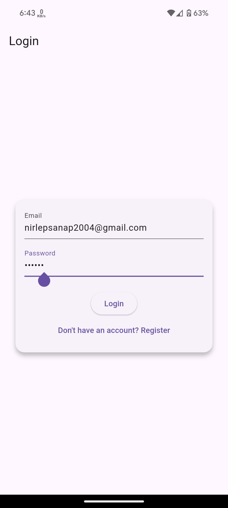
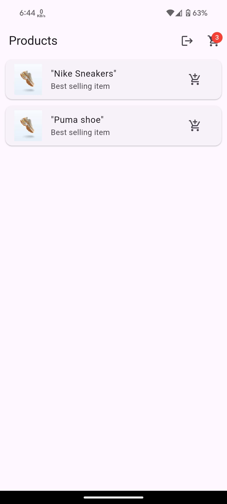
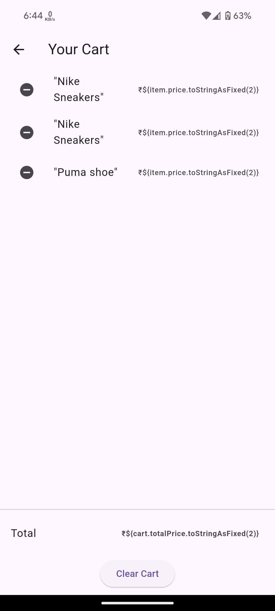

# 🛍️ Flutter Shopping App

A sleek and simple shopping app built using **Flutter** and **Firebase**.

## 🚀 Features

- 🔐 Firebase Email & Password Authentication  
- 🛒 Product listing with images from Firestore  
- ➕ Add to Cart / ➖ Remove from Cart  
- 💾 Cart state managed with **Provider**  
- 📱 Clean UI and responsive design

## 📸 Screenshots

| Login | Products | Cart |
|-------|----------|------|
|  |  |  |

## ⚙️ Getting Started

1. **Clone the repo**
   ```bash
   git clone https://github.com/your-username/flutter-shopping-app.git
   cd flutter-shopping-app
   ```

2. **Install dependencies**
   ```bash
   flutter pub get
   ```

3. **Firebase Setup**
   - Create a Firebase project
   - Enable **Authentication** (Email/Password)
   - Setup **Cloud Firestore**
   - Add `google-services.json` to `/android/app`

4. **Run the app**
   ```bash
   flutter run
   ```

## 📁 Folder Structure

```
lib/
├── main.dart
├── models/
├── screens/
├── providers/
├── widgets/
```

## 🔧 Built With

- Flutter
- Firebase Auth & Firestore
- Provider for State Management

## 👨‍💻 Developer

**Nirlep Sanap**  
[GitHub](https://github.com/your-username) • [Portfolio](https://your-portfolio.com)

---

⭐ Star this repo if you found it helpful!
